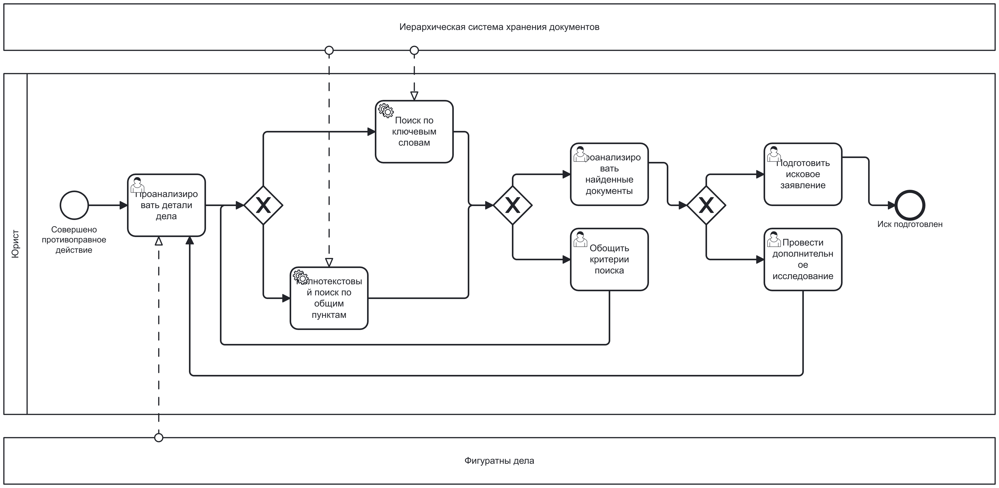
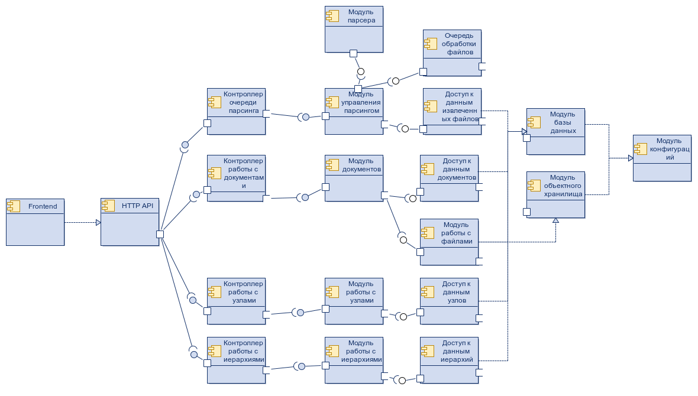

# Иерархическая система хранения документов

## Цели

Цель: Разработать программное обеспечение для организации хранения документов в древовидных иерархиях с поддержкой полнотекстового поиска.

Решаемая проблема: Отсутствие удобной системы для структурированного хранения нормативно-правовых актов, технической документации и других документов с возможностью их категоризации в древовидные структуры и поиска по содержимому.

## Функциональные требования

1. Работа с иерархиями:

    - Создание корневых и дочерних узлов

    - Перенос поддеревьев между узлами

    - Получение полных деревьев и поддеревьев

    - Удаление узлов и целых иерархий

1. Работа с документами:

    - CRUD операции с документами

    - Привязка документов к узлам иерархии (документ можно привязать к нескольким узлам)

    - Загрузка/удаление файлов документов

    - Установление связей между документами

    - Поиск по названию, тегам и содержимому

1. Работа с файлами:

    - Парсинг содержимого файлов (PDF, DOCX, TXT) для дальнейшего поиска по тексту
документа

## Use-Case диаграмма

## BPMN-диаграммы

### Добавление нового документа

### Подготовка судебного иска 

### Списание имущества

## Сценарии использования

1. Сценарий 1: Добавление нового документа

    - Пользователь аутентифицируется

    - Заполняет метаданные (название, описание, теги)

    - Пользователь выбирает целевые узлы в иерархиях

    - Загружает файлы документа

    - Система планирует парсинг содержимого файлов

    - Документ становится доступен для поиска

1. Сценарий 2: Поиск документов

    - Пользователь аутентифицируется

    - Пользователь вводит критерии поиска (по названию, тегам, содержимому)

    - Система отображает релевантные документы

1. Реорганизация иерархии

    - Администратор аутентифицируется

    - Администратор выбирает узел для перемещения

    - Вводит новый родительский узел

    - Система проверяет допустимость операции (избегание циклов)

    - Все дочерние элементы автоматически перемещаются вместе с узлом

## ER-диаграмма 

## Технологический Стек

1. Серверная часть
    - Язык: TypeScript
    - Фреймворк: NestJS
    - Http сервер: Express
    - Среда выполнения: Node.js
    - Взаимодействие с БД: TypeORM

1. Хранение данных
    - База данных: PostgreSQL
    - Хранилище документов: Minio
    - Миграции БД: goose

1. Фронтенд
    - Язык: TypeScript
    - Фреймворк: Vue.js
    - CSS-фреймворк: TailwindCSS

## Реляционная схема

## Диаграмма компонентов

## Экраны приложения

